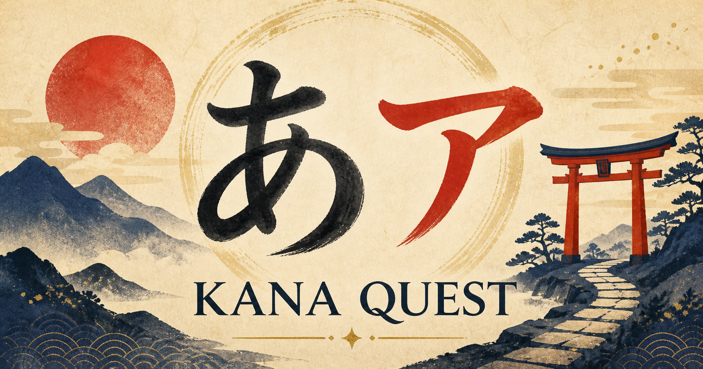

# Kana Quest

Kana Quest is a short, game-like learning experience for memorizing the 46 basic Japanese kana. It teaches hiragana and katakana together through focused lessons, active recall, matching questions, and spaced review.



## Live Demo

[Play Kana Quest online](https://kana-quest.raymond-yeh-8e8.workers.dev)

## Features

- Learn hiragana and katakana as paired representations of the same sound.
- Follow a ten-stop journey covering all 46 basic kana.
- Practice with sound recognition, matching, and active-recall questions.
- Revisit missed or weaker kana through lightweight spaced repetition.
- Keep stars, mastery, settings, and streaks locally on the current device.
- Use Japanese browser speech synthesis when it is available.
- Switch interface language without losing learning progress.

## Languages

The interface and all 46 mnemonic hints are available in:

- English
- Traditional Chinese (`zh-Hant`)
- Simplified Chinese (`zh-Hans`)
- Spanish (`es`)

Visiting the root URL selects the closest supported browser language. Each language also has a stable route, such as `/en`, `/zh-Hant`, `/zh-Hans`, or `/es`.

## Development

### Requirements

- Node.js 22.13 or newer
- npm

### Run locally

```bash
npm install
npm run dev
```

The development server is available at `http://localhost:3000` by default.

### Validate changes

```bash
npm run lint
npm run typecheck
npm test
```

The full test command runs unit tests, creates a production build, and verifies server-rendered HTML for the root page and every supported locale.

## Deployment

Kana Quest is configured for Cloudflare Workers. Authenticate Wrangler once, validate the checked-in configuration, and deploy:

```bash
npx wrangler login
npm run cf:types
npm run deploy:check
npm run deploy
```

The default deployment uses Cloudflare's free `workers.dev` domain. No database, object storage, or paid binding is required.

## Technology

- React 19 and TypeScript
- Vinext and Vite
- Cloudflare Workers-compatible runtime
- Vitest and Node.js test runner

Kana Quest does not require an account or database. Learning progress is stored in the browser's `localStorage` and automatically migrates from the original save format.

## Contributing

Issues and focused pull requests are welcome. Please run `npm run lint` and `npm test` before submitting a change. New interface languages should include complete UI messages, ten journey stop names, and mnemonic hints for all 46 kana.

## Contact

For project or commercial enquiries, contact [hello@milkfish.digital](mailto:hello@milkfish.digital).

## License

Kana Quest is available under the [MIT License](LICENSE).
